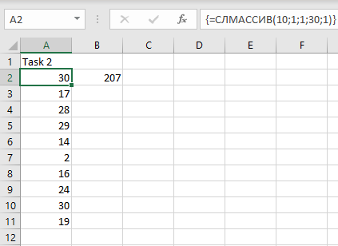
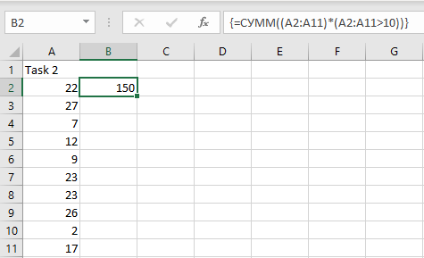
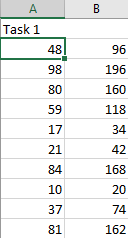

# Задание 1. Умножение всех чисел в столбце на 2.
1. В ячейке A2 создадим случайный массив из 10 элементов с помощью функции:
**=СЛМАССИВ(10;1;1;100;1)**
   ![[img/8.png]] 
2. В ячейке B2 запишем формулу для умножения каждого числа из первого массива на 2:
**=A2:A11\*2**
![[img/4.png]]	
# Задание 2. Сумма всех чисел в массиве, больших 10.
1. В ячейке A2 создадим случайный массив из 10 элементов с помощью функции: 
**=СЛМАССИВ(10;1;1;30;1)**

2. В ячейке B2 запишем формулу для суммы всех чисел в массиве, больших 10:
**=СУММ((A2:A11)*(A2:A11>10))**

# Задание 3. Вывод списка уникальных значений из диапазона A1:A10.
1.  В ячейке A2 создадим случайный массив из 10 элементов с помощью функции:
**=СЛМАССИВ(10;1;1;20;1)**

2. В ячейке B2 запишем формулу для вывода списка уникальных значений из диапазона A2:A11:
   ![[13.png]]
3. ![[14.png]]

